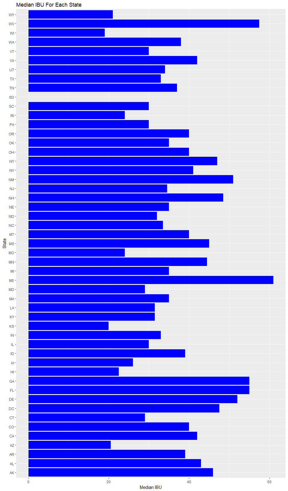

# Beer Analysis
Bradley Robinson, William Gonzalez  
Due: October 23, 2017  


### Introduction
Within the United States, beer is a popular adult beverage, but tastes can vary by area. When making decisions about the type of beer to sell in a particular area, there are some statistics that make it possible to know what beers are already available in these states. While looking at many of the chemical properties of a particular product might be difficult, alcholol content and bitterness are simple measures that tell a lot about a brew.

### Preparing the data
The first step is to prepare the data to be processed in R by loading and merging the datasets. For this analysis, there are two datasets that will be used. The first included a list of beers and information about them. The second is a list of breweries (with IDs that correspond with the first) and information about where they are. After reading in the data, the first six rows of each dataset look like this:


```r
beers <- read.csv("./Data/Beers.csv")
breweries <- read.csv("./Data/Breweries.csv")
head(beers)
```

```
##                  Name Beer_ID   ABV IBU Brewery_id
## 1            Pub Beer    1436 0.050  NA        409
## 2         Devil's Cup    2265 0.066  NA        178
## 3 Rise of the Phoenix    2264 0.071  NA        178
## 4            Sinister    2263 0.090  NA        178
## 5       Sex and Candy    2262 0.075  NA        178
## 6        Black Exodus    2261 0.077  NA        178
##                            Style Ounces
## 1            American Pale Lager     12
## 2        American Pale Ale (APA)     12
## 3                   American IPA     12
## 4 American Double / Imperial IPA     12
## 5                   American IPA     12
## 6                  Oatmeal Stout     12
```

```r
head(breweries)
```

```
##   Brew_ID                      Name          City State
## 1       1        NorthGate Brewing    Minneapolis    MN
## 2       2 Against the Grain Brewery    Louisville    KY
## 3       3  Jack's Abby Craft Lagers    Framingham    MA
## 4       4 Mike Hess Brewing Company     San Diego    CA
## 5       5   Fort Point Beer Company San Francisco    CA
## 6       6     COAST Brewing Company    Charleston    SC
```
##### The data is read in from csv files and displayed using the head function.

### Questions of Interest

#### How many breweries are present in each state??

Each state can be ranked by how many breweries there are.


```r
breweries_states_count <- breweries %>%
  group_by(State) %>%
  summarise(Freq = n())
state_ordered <- breweries_states_count[order(-breweries_states_count$Freq),]
head(state_ordered, n = 10)
```

```
## # A tibble: 10 x 2
##     State  Freq
##    <fctr> <int>
##  1     CO    47
##  2     CA    39
##  3     MI    32
##  4     OR    29
##  5     TX    28
##  6     PA    25
##  7     MA    23
##  8     WA    23
##  9     IN    22
## 10     WI    20
```
###### First, the data was grouped by state, then the amount of entries in each state were counted. The data was sorted and the displayed.

Perhaps unsurprisingly, many of the states with large amounts of breweries are known for having cultural interests in beer.

#### Combining Datasets

Both datasets can be combined so that it is possible to observe how beer differs between each state, and to see what beers might be available in each state without having to look between two datasets.

```r
names(breweries) <- c("Brewery_id", "Brewery_Name", "City", "State")
merged <- merge(beers, breweries, by = c("Brewery_id")) 
head(merged)
```

```
##   Brewery_id          Name Beer_ID   ABV IBU
## 1          1  Get Together    2692 0.045  50
## 2          1 Maggie's Leap    2691 0.049  26
## 3          1    Wall's End    2690 0.048  19
## 4          1       Pumpion    2689 0.060  38
## 5          1    Stronghold    2688 0.060  25
## 6          1   Parapet ESB    2687 0.056  47
##                                 Style Ounces       Brewery_Name
## 1                        American IPA     16 NorthGate Brewing 
## 2                  Milk / Sweet Stout     16 NorthGate Brewing 
## 3                   English Brown Ale     16 NorthGate Brewing 
## 4                         Pumpkin Ale     16 NorthGate Brewing 
## 5                     American Porter     16 NorthGate Brewing 
## 6 Extra Special / Strong Bitter (ESB)     16 NorthGate Brewing 
##          City State
## 1 Minneapolis    MN
## 2 Minneapolis    MN
## 3 Minneapolis    MN
## 4 Minneapolis    MN
## 5 Minneapolis    MN
## 6 Minneapolis    MN
```

```r
tail(merged)
```

```
##      Brewery_id                      Name Beer_ID   ABV IBU
## 2405        556             Pilsner Ukiah      98 0.055  NA
## 2406        557  Heinnieweisse Weissebier      52 0.049  NA
## 2407        557           Snapperhead IPA      51 0.068  NA
## 2408        557         Moo Thunder Stout      50 0.049  NA
## 2409        557         Porkslap Pale Ale      49 0.043  NA
## 2410        558 Urban Wilderness Pale Ale      30 0.049  NA
##                        Style Ounces                  Brewery_Name
## 2405         German Pilsener     12         Ukiah Brewing Company
## 2406              Hefeweizen     12       Butternuts Beer and Ale
## 2407            American IPA     12       Butternuts Beer and Ale
## 2408      Milk / Sweet Stout     12       Butternuts Beer and Ale
## 2409 American Pale Ale (APA)     12       Butternuts Beer and Ale
## 2410        English Pale Ale     12 Sleeping Lady Brewing Company
##               City State
## 2405         Ukiah    CA
## 2406 Garrattsville    NY
## 2407 Garrattsville    NY
## 2408 Garrattsville    NY
## 2409 Garrattsville    NY
## 2410     Anchorage    AK
```
###### Using a simple merge command, the data was put together by brewery ID.

#### Is there missing data?
From analyzing the data, it looks like the columns with missing values are AVB (62 missing) and IBU (1005 missing). 

```r
colSums(is.na(merged))
```

```
##   Brewery_id         Name      Beer_ID          ABV          IBU 
##            0            0            0           62         1005 
##        Style       Ounces Brewery_Name         City        State 
##            0            0            0            0            0
```
###### This piece of code counts the number of NA values of the merged dataframe. 

#### Alcohol contents by volume.
By looking at the median alcohol by volume, we can compare states by how much alcohol there is in each drink.

```r
beers_summarized <- merged %>%
  group_by(State) %>%
  summarise(median_abv = median(ABV, na.rm = TRUE),
          median_ibu = median(IBU, na.rm = TRUE))
head(beers_summarized, n = 10)
```

```
## # A tibble: 10 x 3
##     State median_abv median_ibu
##    <fctr>      <dbl>      <dbl>
##  1     AK     0.0560       46.0
##  2     AL     0.0600       43.0
##  3     AR     0.0520       39.0
##  4     AZ     0.0550       20.5
##  5     CA     0.0580       42.0
##  6     CO     0.0605       40.0
##  7     CT     0.0600       29.0
##  8     DC     0.0625       47.5
##  9     DE     0.0550       52.0
## 10     FL     0.0570       55.0
```
###### Data was grouped by state again, and then the medians of ABV and IBU were taken for each state.

```r
ggplot(data = beers_summarized) +
  geom_col(mapping = aes(x=State, y=median_abv), fill="blue") +
  labs(title="Median ABV In Each State") +
  coord_flip() +
  ylab("Median ABV")
```

<!-- -->

```r
ggplot(data = beers_summarized) +
  geom_col(mapping = aes(x=State, y=median_ibu), fill="blue") +
  labs(title="Median IBU For Each State") +
  coord_flip() +
  ylab("Median IBU")
```

```
## Warning: Removed 1 rows containing missing values (position_stack).
```

<!-- -->
Using the above graphs, states can be compared based on median IBU and median ABV. They can also be arranged in order to see which have the strongest drinks:

```r
by_abv <- beers_summarized[order(-beers_summarized$median_abv),]
head(by_abv)
```

```
## # A tibble: 6 x 3
##    State median_abv median_ibu
##   <fctr>      <dbl>      <dbl>
## 1     DC     0.0625       47.5
## 2     KY     0.0625       31.5
## 3     MI     0.0620       35.0
## 4     NM     0.0620       51.0
## 5     WV     0.0620       57.5
## 6     CO     0.0605       40.0
```

```r
tail(by_abv)
```

```
## # A tibble: 6 x 3
##    State median_abv median_ibu
##   <fctr>      <dbl>      <dbl>
## 1     ME      0.051       61.0
## 2     KS      0.050       20.0
## 3     ND      0.050       32.0
## 4     WY      0.050       21.0
## 5     NJ      0.046       34.5
## 6     UT      0.040       34.0
```
It appears that Utah has the lowest median alcohol content, which probably is due to a law that prevents beers with ABV greater than 3.2% to be sold in grocery stores.
 

#### Which state has the maximum alcoholic (ABV) beer? Which state has the most bitter (IBU) beer?
Answer: The state has the maximum alcoholic (ABV) beer is Colorado with an ABV of 0.128.</br> 
The state has the most bitter (IBU) beer is Oregon with an IBU of 138. 

```r
merged$State[which.max(merged$ABV)]
```

```
## [1]  CO
## 51 Levels:  AK  AL  AR  AZ  CA  CO  CT  DC  DE  FL  GA  HI  IA  ID ...  WY
```

```r
max(merged$ABV, na.rm = TRUE)
```

```
## [1] 0.128
```

```r
merged$State[which.max(merged$IBU)]
```

```
## [1]  OR
## 51 Levels:  AK  AL  AR  AZ  CA  CO  CT  DC  DE  FL  GA  HI  IA  ID ...  WY
```

```r
max(merged$IBU, na.rm = TRUE)
```

```
## [1] 138
```
###### The first and third lines of code find the State for the highest ABV and IBU respectively. </br>
###### The second and fourth lines of code find the actual value. </br>
 

#### Summary statistics for the ABV variable.
We can see a summary of statistics for ABV in the dataset:

```r
summary(merged$ABV)
```

```
##    Min. 1st Qu.  Median    Mean 3rd Qu.    Max.    NA's 
## 0.00100 0.05000 0.05600 0.05977 0.06700 0.12800      62
```
It appears that most content amounts center around .056. Using a histogram, we can visualize the same thing:

```r
ggplot(data = merged) +
  geom_histogram(mapping = aes(ABV), fill = "darkblue") + 
  labs(title="Histogram of ABV", y="Frequency")
```

```
## `stat_bin()` using `bins = 30`. Pick better value with `binwidth`.
```

```
## Warning: Removed 62 rows containing non-finite values (stat_bin).
```

<!-- -->
This also shows that there are less beers that have contents below the center of distribution (mean) than there are that have more than.
###### Data was summarized using the summary function, and graphed with ggplot.

#### Is there an apparent relationship between the bitterness of the beer and its alcoholic content? 
Answer: Judging from the data, there appears to be a very mild positive linear correlation between the Bitterness (IBU) vs Alcohol Content (ABV). 

```r
ggplot(merged, aes(x=IBU, y=ABV,na.rm=FALSE)) + geom_point() + geom_smooth(method=lm) + labs(title="Scatterplot of Bitterness (IBU) vs Alcohol Content (ABV)") + theme_classic() 
```

```
## Warning: Removed 1005 rows containing non-finite values (stat_smooth).
```

```
## Warning: Removed 1005 rows containing missing values (geom_point).
```

<!-- -->

###### Using function ggplot to find the relationship between the bitterness of the beer and its alcoholic content. The resulting scatterplot shows a very mild positive correlation between those two values.  

### Conclusion

At the customer's request, we analyzed and merged data from two datasets, [Beers.csv](./Data/Beers.csv) and [Breweries.csv](./Data/Breweries.csv).  
After preparing the data and running some analysis, we answered the customer's questions of interest above and prepared this report. Although this was not part of the original customer request, and since there are many different types of craft beers in the USA, we also provided a reference chart summarizing the beer type an and the count of that type made by USA breweries. This info can be found in the file: [beer-types.csv](./Data/beer-types.csv).

This repository can be found: https://github.com/bradleyrobinson/Beer.
